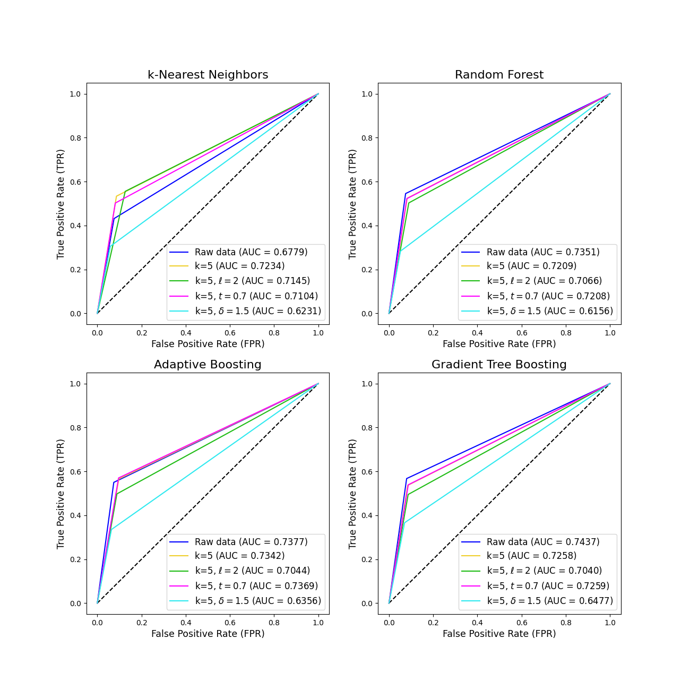

# Comparison of Machine Learning models applied on anonymized data with different techniques

**Author:** Judith Sáinz-Pardo Díaz (IFCA - CSIC)

**Abstract:** Anonymization techniques based on the application of different levels of hierarchies on quasi-identifiers are widely used in order to achieve pre-established levels of privacy. In order to prevent different types of attacks against databases it is necessary to apply several anonymization techniques beyond the classical ones such as _k-anonymity_ or _l-diversity_. However, the application of these methods is directly connected to a reduction of their usefulness in terms of their use in prediction tasks, decision making, etc. Four classical Machine Learning methods currently used for classification tasks are studied in order to analyze the results as a function of the anonymization techniques applied and the parameters selected for each of them. First, different values of _k_ for _k-anonymity_ are stablished, then, with a values of _k=5_ fixed three other methods are applied: _l-diversity_, _t-closeness_ and _δ-disclosure privacy_. The anonymization process has been carried out using the ARX Software [1]. 

## Brief summary of results
The results of applying four machine learning models: _kNN_, _Random Forest_, _Adaptive Boosting_ and _Gradient Tree Boosting_ on the following 5 scenarios on the adult datset are shown by means of ROC curves in Figure 1.
- Scenario 1: raw data [adult_raw.ipynb](https://gitlab.ifca.es/privacy-security/anonymity-ml/-/blob/main/ml_models/adult_raw.ipynb).
- Scenario 2: k-anonymity with k=5 ([adult_k5.ipynb](https://gitlab.ifca.es/privacy-security/anonymity-ml/-/blob/main/ml_models/adult_k5.ipynb)).
- Scenario 3: k-anonymity with k=5 and _l-diversity_ with _l=2_ ([adult_k5_l2.ipynb](https://gitlab.ifca.es/privacy-security/anonymity-ml/-/blob/main/ml_models/adult_k5_l2.ipynb)).
- Scenario 2: k-anonymity with k=5 and _t-closenss_ with _t=0.7_ ([adult_k5_t07.ipynb](https://gitlab.ifca.es/privacy-security/anonymity-ml/-/blob/main/ml_models/adult_k5_t07.ipynb)).
- Scenario 2: k-anonymity with k=5 and _δ-disclosure privacy_ with _δ=1.5_ ([adult_k5_delta15.ipynb](https://gitlab.ifca.es/privacy-security/anonymity-ml/-/blob/main/ml_models/adult_k5_delta15.ipynb)).

Using the Python library _pyCANON_ [2], we have analyzed the metrics that are verified for each of the anonymity techniques used.  (see [check_anonymity.py](https://gitlab.ifca.es/privacy-security/anonymity-ml/-/blob/main/anonymity_metrics/check_anonymity.py)). Specifically, it is can be cheacked that when _δ=1.5_, the value of _t_ for _t-closeness_ is 0.47 (lower than the one set in the scenario where _t-closeness_ is satisfied for _t=0.7_). This is the most restrictive scenario (_δ=1.5_), and the results in each case go hand in hand with the ranking metric calculated in each case (see [anonymity_metrics.py](https://gitlab.ifca.es/privacy-security/anonymity-ml/-/blob/main/anonymity_metrics/anonymity_metrics.py)).

An analogous analysis has also been carried out for different values of _k_ for _k-anonymity_, in particular for _k=2, 5, 10, 15, 20, 25, 50, 75, 100_ (see [ml_varying_k.py](https://gitlab.ifca.es/privacy-security/anonymity-ml/-/blob/main/ml_models/varying_k/ml_varying_k.py)). And the average equivalence class metric has also been analyzed togueter with the accuracy and the AUC obtained with each ML model.

## License
This project is licensed under Apache License Version 2.0 (http://www.apache.org/licenses/).

## References 
[1] Prasser, Fabian, and Florian Kohlmayer. "Putting statistical disclosure control into practice: The ARX data anonymization tool." Medical data privacy handbook (2015): 111-148.

[2] Sáinz-Pardo Díaz, Judith, and Álvaro López García. "A Python library to check the level of anonymity of a dataset." Scientific Data 9.1 (2022): 785.
